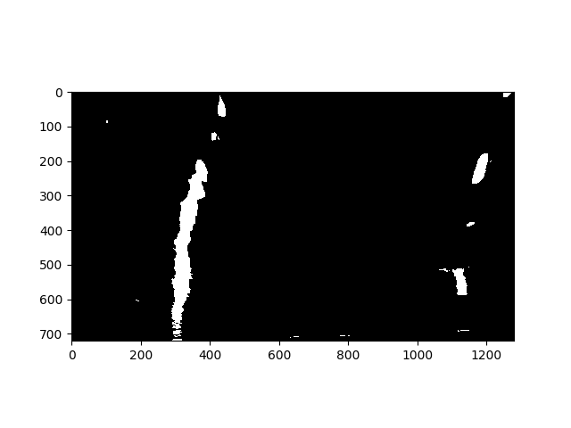

# Advanced lane finding

## Overview
The readme file explains the process I followed for finding lanes on
the road using various processes. It relies of different stages of camera
calibration, image processing and filtering, image warping, some algebra
and newly learned Python skills :)

For the second submission I firstly transformed the image for a bird's eye view,
and only after that did I apply the pipeline to find the lanes. This created a much cleaner
picture to use for line fitting. Thanks to the reviewer for this tip!

## Camera calibration
The first step is to calibrate the camera. Every camera has a unique lens which
distorts the lights that enters the camera. A good approach for 'undistorting' your
images is by using a chess-board image. OpenCV has a few functions which uses
these chessboards to calculate by how much you need to undistort your images.

The code for the camera calibration can be found under ~/calibrate_camera.py

It relies on the `findChessboardCorners` and `calibrateCamera` functions in the openCV library.
`findChessboardCorners` takes in an image with the number or row and column corners it should expect
to find in the image. The output of this is an array of where it found the corners. `calibrateCamera` Then uses
these corners and projects it onto a "flat surface", meaning it takes out the curvature of the image create by
the lens.

Below is a photo as taken by the camera.

And this is after undistoring the image:

You can see there aren't any curved lines in the second image. The calibrate_camera.py script goes through
all the images in the camera_cal folder and create `dist` and `mtx` variables which will be used to undistort
 the lane images.

## The pipeline
The pipeline first undistorts the image using the `dist` and `mtx` variables created by the
calibrate_camera.py script.

After undistorting the image, one can start
applying different filters to try and find the lanes.

Below is an example of what a typical undistorted frame would look like:

### 1. Transform
As I mentioned above, I start of with the transformation of distorted image to get a bird's
eye view of the lane. To do this, I predefined an area I want to transform.
 Below is an image showing off the masked area,
 followed the coordinates of the initial masked area. The function that transforms
 the image can be found in transform.py. More info on these points later on

|Point       |Location (x,y) |
|------------|---------------|
|Bottom left |(0, 690)       |
|Top left    |(560, 450)     |
|Top right   |(720, 450)     |
|Bottom right|(1280, 690)    |

This is what the transformed image looks like:

### 2. Sobel
The sobel pipeline looks for edges in the image, calculates the magnitude of edges and also the gradient.
It then returns a binary image depending on what thresholds were used.
The sobel pipeline can be found under sobel.py

As you can see, the Sobel function didn't find much detail in this frame.
The color filter will take care of that

### 3. Color filters
Parallel to the Sobel filtering, I also apply color filters to highlight the lanes.
I consider the hue and saturation from the HSV conversion of the image, the lightness and saturation
from the HLS conversion. I also have a filter that looks specifically for white and yellow areas.
I then use a threshold to get a binary output from the image.
The color filter function can be found under color.py

This gives a much better binary map of where the lanes are.

### 4. Combining Sobel and color filters
I then stack the output from the Sobel and color filters to get a binary image which will be used for lane
detection. Below is the result of the stacked images

### 5. Fitting lines
This is where the algebra comes in. The challenge here is to fit lines over the white blobs.
This is done by firstly finding what the x locations are of the white blobs, this will act as a starting point.
I take the bottom third of the image, and sum all the 1's (white spots) on the image, and look for the peaks.
Then I repeat the same principle on smaller slices of the image, using the previous slices' peaks as a starting point for the next slice

After this is done, I have an array of locations of possible lane locations. I then fit a second degree polynomial function on
 both the left side of the image and the right side of the image. The code can be found under mask_lanes.py

 The result looks something like this:

In the same function, I calculate the curvature of the left and right lines. This happens in lines 92 and 94.

### 6. Projecting the lines
And finally I project the lines back onto the road, fill the lane with a green shade,
and add the curvature values to the image. The function can be found under project_lanes.py

The final result looks something like this:

 

### 7. Additional tuning

I use the average of the past 20 frames to smooth out the lane lines.
After every frame I shift the masked area to fit over the lines (with a margin on either side).
I also smooth out the curvatures of the last 100 frames. Lane curvature changes very smoothly,
as opposed to lane markings which can be much sporadic.

### Video output

Here's a link to the video output: [Project video](https://youtu.be/GgDEE5CProU)

## Discussion
### Challenges
The main challenge was to get the thresholds right for all of the color and line filters.
There will always be cases where the filters miss something, or allow for too much noise,
so the challenge was to have the and/ or statement set up to grab most of the useful information
while decreasing the noise.

The other problem is sporadic outliers. For instance a single frame where the lane line fits in the
wrong direction or a spot on the tarmac distorts lane finding process (where it takes slices and
look for peaks). This problem can be approached by using classes - something I
had to learn for this project. The way I use classes was to smooth out the
lines over 20 frames, and the curvature over 100 frames.

On top of that I also used the matchShapes function in the OpenCV library (thanks to the reviewer again :))
This function in essence checks how close to shapes are to each other. I used this to check
if each lane line in the frame is close the the previous frame's lines

### Room for improvement
I think this pipeline is good enough for ideal road conditions. But the challenge and extra challenge videos
 have events that will make this pipeline second guess its existence. Most likely adding more